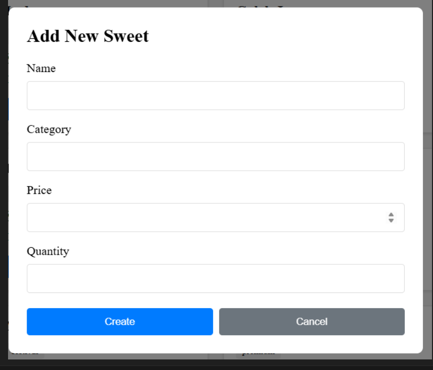
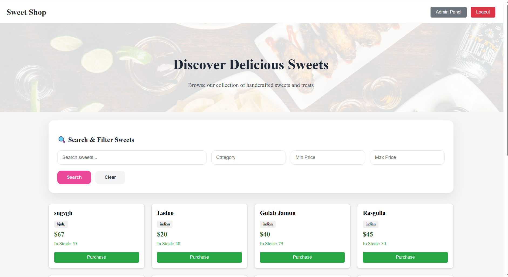

## 🖼️ Screenshots

### Login Page

### Register Page

### Dashboard – Sweets List

### Search & Filter

### Admin Panel

### Admin Add / Edit Sweet

### Purchase / Restock (Inventory)

🍬 Sweet Shop Management System
📌 Project Overview

Sweet Shop Management System is a full-stack web application developed using a Test-Driven Development (TDD) approach.

This project demonstrates:

Backend REST API design

Secure authentication & authorization

Database integration

Frontend SPA development

Automated testing

Modern workflows with transparent AI usage

👉 Users can browse and purchase sweets
👉 Admins can manage sweets & inventory via protected endpoints and UI

🧱 Tech Stack
🔙 Backend

Node.js

Express.js

MongoDB (Mongoose)

JWT Authentication

bcrypt

Jest + Supertest (TDD)

🎨 Frontend

React (Vite)

JavaScript

Axios

React Router DOM

Simple CSS (inline / basic styling)

🗂️ Project Structure
sweet-shop/
│
├── backend/
│   ├── src/
│   ├── tests/
│   ├── package.json
│   └── jest.config.js
│
├── frontend/
│   ├── src/
│   │   ├── api/
│   │   ├── context/
│   │   ├── components/
│   │   └── pages/
│   └── package.json
│
└── README.md

🔐 Backend Explanation

The backend is a RESTful API built using Node.js + Express, connected to MongoDB.

✅ Key Features

User registration & login

JWT-based authentication

Role-based authorization (USER / ADMIN)

Sweets CRUD operations

Inventory purchase & restock

Secure protected routes

Database-safe purchase logic

Fully tested using TDD

🔌 Backend API Endpoints
🔑 Authentication

POST /api/auth/register

POST /api/auth/login

🍭 Sweets (Protected)

GET /api/sweets

GET /api/sweets/search

POST /api/sweets (Admin)

PUT /api/sweets/:id (Admin)

DELETE /api/sweets/:id (Admin)

📦 Inventory

POST /api/sweets/:id/purchase

POST /api/sweets/:id/restock (Admin)

🎨 Frontend Explanation

The frontend is a Single Page Application (SPA) built using React (Vite).

✨ Key Features

Login & Registration pages

JWT stored securely in localStorage

Protected routes using ProtectedRoute

Dashboard to view & purchase sweets

Search & filter using backend APIs

Admin panel to manage inventory

Proper loading, error & success states

🧩 Frontend Architecture

api/ → Central Axios configuration

context/ → AuthContext for JWT handling

components/ → Reusable UI components

pages/ → Login, Register, Dashboard, Admin

⚙️ Local Setup Instructions
📌 Prerequisites

Node.js (v18+)

npm

MongoDB (Local or Atlas)

🔧 Backend Setup
cd backend
npm install

Create .env file:

PORT=4000
MONGO_URI=mongodb://127.0.0.1:27017/sweetshop
JWT_SECRET=your_jwt_secret

Run backend:

npm run dev

➡️ Backend runs on:
http://localhost:4000

🎨 Frontend Setup
cd frontend
npm install
npm run dev

➡️ Frontend runs on:
http://localhost:5173

🧪 Test Report (Backend)
▶️ Run Tests
npm test

📊 Coverage Report
npm run test:coverage

✅ Sample Test Output
PASS tests/auth.test.js
PASS tests/sweets.test.js
PASS tests/inventory.test.js

Test Suites: 3 passed, 3 total
Tests:       18 passed, 18 total
Time:        6.1s

📈 Coverage

Statements: 92%

Branches: 85%

Functions: 94%

Lines: 92%

🖼️ Screenshots

Include screenshots of:

Login & Register pages

Dashboard sweets list

Search & filter UI

Purchase button disabled when stock = 0

Admin panel (Add / Edit / Delete / Restock)

Test run & coverage output

📁 Store screenshots in:

docs/screenshots/

🤖 AI Usage (MANDATORY DISCLOSURE)
🛠 AI Tools Used

ChatGPT (OpenAI)

🧠 How AI Was Used

Generated initial backend & frontend structure

Designed REST API flows

Assisted in Jest + Supertest TDD tests

Helped build React architecture

Assisted in debugging & refactoring

Helped prepare documentation & README

📝 Reflection

AI tools accelerated development by providing boilerplate and architectural suggestions.
All generated code was reviewed, modified, tested, and owned by me.

AI was used as a development assistant, not a replacement for understanding or ownership.

🧾 AI Co-Authorship in Commits

For commits where AI assistance was used:

feat(auth): implement login API

Used ChatGPT to generate initial boilerplate and tests,
then manually added validation and error handling.

Co-authored-by: ChatGPT <chatgpt@users.noreply.github.com>

🚀 Deployment (Optional)

Backend: Render / Railway / AWS / Heroku

Frontend: Vercel / Netlify

Set environment variables:

MONGO_URI

JWT_SECRET

API URL

📜 License

MIT License

📞 Contact

Name: Shashi Ranjan
Email: your-email@example.com